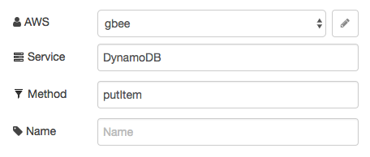
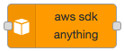

# node-red-contrib-aws-sdk-anything

## Feature

* Various services of `aws sdk` can be used.

## Released

|Date|Version|Description|
|:--:|:--:|:--|
|2018-05-15|0.2.1|supported S3.getSignedUrl|
|2017-09-25|0.1.0|Return `msg.err` and `msg.params` .|
|2017-09-02|0.0.1|Released|


## Install

```bash
npm install --save node-red-contrib-aws-sdk-anything
```

## Usage



* Node Settings
  * AWS = IAM AccessKey
  * Service = DyanamoDB, ...
  * Method = putItem, ...
  * Name = 
* msg Object
  * payload = Params

## Screenshot



## Example Flow


```json
[
    {
        "id": "ed786802.6c74b8",
        "type": "inject",
        "z": "3b5b5291.aa56ae",
        "name": "",
        "topic": "",
        "payload": "",
        "payloadType": "date",
        "repeat": "",
        "crontab": "",
        "once": false,
        "x": 140,
        "y": 80,
        "wires": [
            [
                "7acc1c22.943544"
            ]
        ]
    },
    {
        "id": "c936f3c0.21ea2",
        "type": "debug",
        "z": "3b5b5291.aa56ae",
        "name": "",
        "active": true,
        "console": "false",
        "complete": "false",
        "x": 770,
        "y": 80,
        "wires": []
    },
    {
        "id": "7acc1c22.943544",
        "type": "function",
        "z": "3b5b5291.aa56ae",
        "name": "Make params",
        "func": "var dd = new Date();\nmsg.payload = {\n    TableName: \"test\",\n    Item: {\n        id: {\n            S: \"datetime\" + dd\n        },\n        timestamp: {\n            N: \"100\"\n        },\n        json: {\n            S: '{\"hoge\":\"value\"}'\n        }\n    }\n};\nreturn msg;",
        "outputs": 1,
        "noerr": 0,
        "x": 320,
        "y": 80,
        "wires": [
            [
                "c57cce37.208fd"
            ]
        ]
    },
    {
        "id": "c57cce37.208fd",
        "type": "aws-sdk-anything",
        "z": "3b5b5291.aa56ae",
        "aws": "c5f05f2f.06aa",
        "region": "",
        "servicename": "DynamoDB",
        "methodname": "putItem",
        "name": "",
        "x": 550,
        "y": 80,
        "wires": [
            [
                "c936f3c0.21ea2"
            ]
        ]
    },
    {
        "id": "c5f05f2f.06aa",
        "type": "aws-sdk-anything-config",
        "z": "",
        "name": "gbee",
        "region": "ap-northeast-1"
    }
]
```

## Environment

Node-RED

## Confirmed List

1. DynamoDB
    1. putItem

